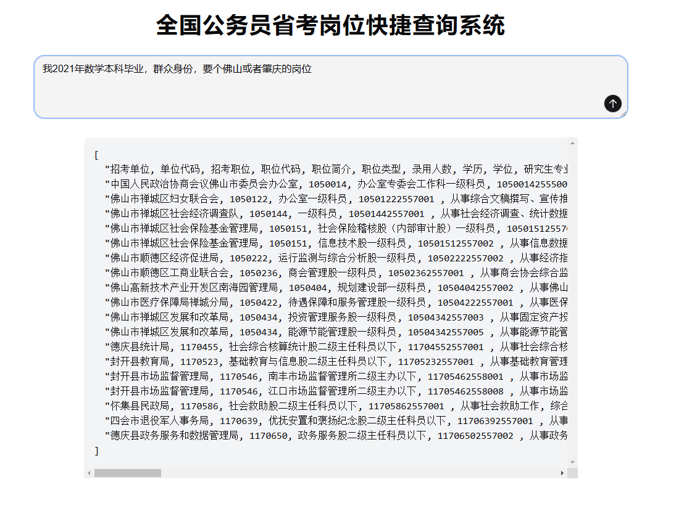

# AI 公务员岗位筛选器

我们的公务员考试很多岗位都有限制，官方给的查询系统太垃圾了，很多搜索做不了。

举个例子，我本科学的是数学，适合什么岗位？

你是不是第一反应就去官网岗位查找器里面搜数学？ 

错了！有的岗位是不限制专业的，你搜数学的话，这部分岗位是不会显示的。

你可能说：搜两次不就行了？ 一次搜数学一次搜不限。

又错了！有的岗位限制是“理学”，它是包含数学的，但你直接搜数学的话是搜不出来这些岗位的。

## 为什么要 AI

逐字匹配太容易出错了，而且说不定他哪些字段里面给你搞个空格或者逗号错误，比如 `数、学` 那就彻底没法搞了。

唯一的出路：让 AI 去阅读每一条岗位描述，每条岗位给出 `对 or 错`，这样考生只需要口头描述一下就可以搜了。

## 技术路线

前端：
Next.js
Tailwind CSS
Shadcn UI

后端:
Go
并发查询
DeepSeek API

DevOps：
阿里云
函数计算
Docker 自定义容器部署

## 留了一手

我的微信号 drinking-soda

这项目前端开源，后端和部署不开源。

如果你想要自己部署商用，或者集成到公司产品中，请加我微信。

有多种协作方式： 直接买源码、让我辅助你部署到自己的网站、让我做一些定制化改进、短期雇佣我把它集成到你们公司项目中、直接招聘我做正式员工、你是创业者想和我一起合作， 这些都是可以的

如果你是开源爱好者，单纯想交流一下技术也可以的。我只是反对别人白嫖我代码赚钱；如果你并不用来盈利的话，我也愿意无偿分享知识和经验。

总之，你见到这个项目的话就加我吧，多个好友多条路，很多东西都可以合作的。 甚至不合作，单纯聊天也可以。

## 难点

前端就一个大标题 + 文本区域 + 按钮，当送你了。

这个项目难点在于后端和运维。

主要就是几个问题

1. 每个省大约会有 6000 到 1w 条岗位信息，你逐条拿去问 DeepSeek，耗时很长的，用户不会有耐心等待，你必须多进程并发查询

比方说你一共有 1w 条数据，每条数据要拿去问 DeepSeek，同一时刻有 100 个进程同时问询。

每个进程问完了，它就会自动退出去，让给下一个问题进入池子。

这个可有讲究了，你需要处理一堆锁和信号量，这个过程非常麻烦，用 JS Promise 几乎无法完成。所以要用 Go。

2. 即使是并发问询，时间也有大概20秒左右，得留个进度条给客户看。

实现进度条这个也不简单，你必须在问询过程中，每个进程问完了要用 websocket 向前端发送消息，不加锁的话就会有两个进程同时使用 connection.send ，立马就报错了

3. 即使你花了大力气解决了上面的问题，还要部署到服务器去吧。

光是域名备案就够你喝一壶，但我的网站是不用备案的，照样可以被国内访问，而且完全合法合规，想知道我怎么做到的吗？

4. 域名弄好了，你总得弄个机器托管 go语言后端吧，这个机器配置可不小，租服务器的话太亏了，因为大部分时间没人访问你的网站，cpu空转要花不少钱。 

所以要用云函数，它只会在有人访问时启动，没人访问时处于休息状态不扣费。配置云函数也是比较费劲的，也可以问我。

## 加我吧

微信 dringking-soda

我将全力帮你把前后端部分还有部署一条龙全程搞定。所有经验，知无不言。